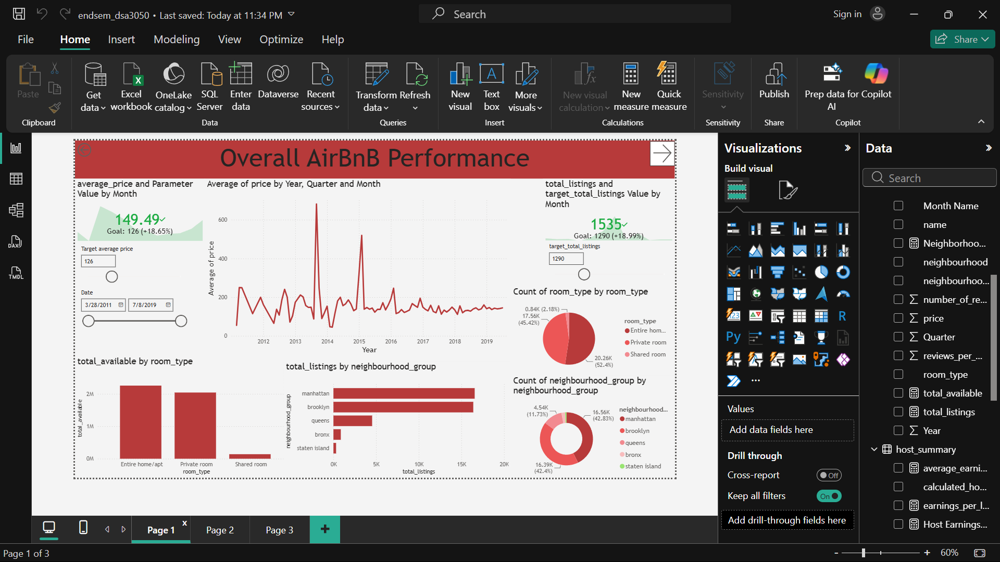
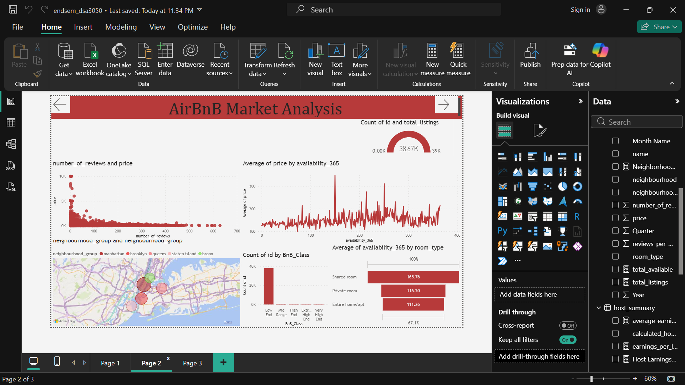
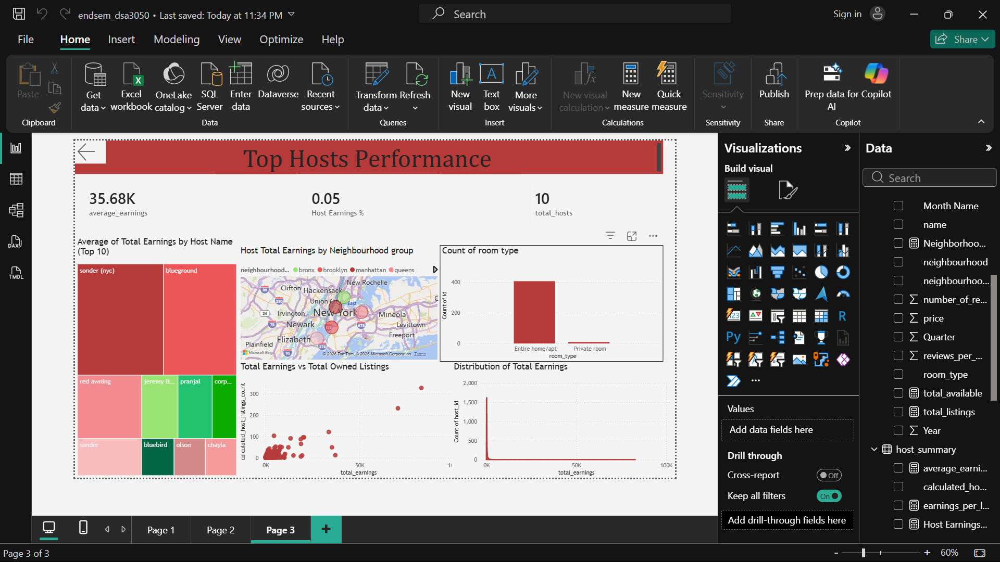

# Airbnb Data Analysis and Power BI Dashboard

## 1. Dataset Source

The dataset used in this project is the **New York City Airbnb Open Data** dataset. It was originally collected from Airbnb listings in New York City and is publicly available through Kaggle.

- **Dataset:** New York City Airbnb Open Data
- **Source:** Kaggle
- **Original platform:** Airbnb

The dataset contains information about Airbnb listings, hosts, locations, prices, reviews, availability, and other characteristics of properties listed in New York City.

## 2. What the Dataset Represents

The dataset represents Airbnb listings in New York City. Each record mainly represents an individual Airbnb listing and contains information about the property, its host, location, room type, price, reviews, and availability.

The dataset also contains host-level information such as the number of listings managed by a host and host earnings. This makes it possible to analyse the Airbnb market from different perspectives, including listing performance, host performance, pricing, and location.

## 3. Why I Selected This Dataset

I selected this dataset because Airbnb is a real-world business platform where data can be used to support decisions made by both hosts and customers.

The dataset contains a wide range of variables that can be used to investigate pricing, demand, availability, location, room types, reviews, and host performance. It also provides enough information to create an interactive Power BI dashboard rather than only performing basic descriptive analysis.

Another reason for selecting the dataset is that the results can be useful to different users. For example, someone planning to start an Airbnb business could use the analysis to understand pricing and locations, while a customer could use it to compare different areas and room types.

## 4. Main Variables Available

| Variable | Description |
|---|---|
| `id` | Unique identifier for an Airbnb listing |
| `host_id` | Unique identifier for the host |
| `host_name` | Name of the host |
| `neighbourhood` | Specific neighbourhood where the listing is located |
| `neighbourhood_group` | Larger geographical area of New York City |
| `latitude` / `longitude` | Geographic coordinates of the listing |
| `room_type` | Type of accommodation, such as Entire home/apt or Private room |
| `price` | Price of the Airbnb listing |
| `minimum_nights` | Minimum number of nights required for a booking |
| `number_of_reviews` | Total number of reviews received by the listing |
| `last_review` | Date of the most recent review |
| `reviews_per_month` | Average number of reviews received per month |
| `calculated_host_listings_count` | Number of listings managed by the host |
| `availability_365` | Number of days the listing is available during a year |
| `total_earnings` | Total earnings associated with the host in the host summary data |

These variables allow the data to be analysed at both the listing level and host level.

## 5. Business/Analytical Problem

The main problem I intend to investigate is how location, room type, pricing, availability, and host characteristics relate to Airbnb performance in New York City.

The analysis will focus on identifying patterns in the Airbnb market that could help hosts make better decisions about where to operate, what type of accommodation to offer, and how to position their listings.

The dashboard will also examine high-performing hosts to identify characteristics associated with successful Airbnb businesses. The Power BI solution will therefore be designed around two main users:

- **Potential Airbnb hosts** who want to understand the market and identify opportunities.
- **Existing hosts** who want to compare their performance with other hosts.

## 6. Analytical Questions

The Power BI dashboard will aim to answer the following questions:

1. What is the overall performance of the Airbnb market in New York City in terms of listings, prices, availability, reviews, and earnings?
2. Which neighbourhoods and neighbourhood groups have the highest and lowest average Airbnb prices?
3. How does Airbnb performance differ between room types such as Entire home/apt, Private room, and Shared room?
4. Which hosts generate the highest total earnings, and what percentage of overall host earnings do they contribute?
5. How many listings do the highest-earning hosts manage, and what room types do they offer?
6. Where are the listings managed by the highest-earning hosts located?
7. Is there a relationship between the number of listings managed by a host and their total earnings?
8. Which neighbourhoods provide customers with the best combination of price and availability?
9. How does listing price relate to the number of reviews and availability?
10. Which room types and locations appear to provide the most attractive opportunities for someone considering starting an Airbnb business?

## 7. Dashboard Structure

The Power BI report is organised into three main pages:

1. **Overall Airbnb Performance** – Provides a high-level overview of the Airbnb market using KPIs and summary visualisations.
2. **Listing and Market Analysis** – Examines pricing, room types, reviews, availability, and neighbourhood characteristics.
3. **Host Performance** – Focuses on host earnings, top-performing hosts, number of listings, and the characteristics of successful hosts.

---

## Section B: Power Query Transformations

### 1. Remove Errors
- **Problem:** Upon uploading, the dataset had errors due to 3 rows missing commas to separate the columns in the CSV.
- **Solution:** The rows were deleted as there were missing values and very little data was lost in this process.
- **Reason:** This was done to ensure no errors are encountered during the analysis and transformation steps.

### 2. Changed Type
- **Problem:** Multiple numerical fields including `price`, `id`, and `host_id` were classified as text instead of numeric data types.
- **Solution:** The data types were changed to Whole Number.
- **Reason:** This ensures modelling and dashboard creation can be done with no issues.

### 3. Removed Blank Rows
- **Problem:** Some rows only contained the ID field, and all other columns were empty.
- **Solution:** As there was no way to infer the missing data, the rows were removed.
- **Reason:** This is done to remove noise and ensure a clean dataset is used in later stages.

### 4. Merged Columns
- **Problem:** Latitude and Longitude were in separate columns.
- **Solution:** Used the Merge function to create one column.
- **Reason:** Reducing the number of columns makes the data easier to work with while retaining all the information.

### 5. Created a Host Summary Table
- **Problem:** Each host had multiple Airbnb listings.
- **Solution:** By duplicating the main table and removing rows that don't have information on the host, a host table was created.
- **Reason:** This was done to make the analysis process much smoother and faster, as opposed to having one large table with all the data.

### 6. Created a Total Earnings Column
- **Problem:** Not enough information was gathered from the hosts.
- **Solution:** By grouping by Host ID and using price × number of listings per host, a new column showing total earnings per host was created.
- **Reason:** This gives more information, providing more insight in the analysis process.

### 7. Made All Text Columns Lowercase
- **Problem:** The text columns were extremely irregular with uppercase and lowercase values.
- **Solution:** All text columns were made lowercase.
- **Reason:** This creates consistency, making the data easier to read and work with, while ensuring that no noise is introduced by misidentifying the same group as different due to different font styles.

### 8. Removed Null Values
- **Problem:** The price and reviews columns contained empty values.
- **Solution:** Due to the low number of missing values (4%), the empty rows were removed.
- **Reason:** To reduce noise in the dataset.

---

## Section C: Data Modelling

The data model follows a **Star schema** structure.

- **Fact table:** `Full_details` — used as the fact table as it contains all the details for each Airbnb listing.
- **Dimension tables:** `review_date_table`, `host_summary`, `location_table`, `dimroom_types`

### Relationships

| Dimension Table | Fact Table | Cardinality | Join Column | Filter Direction |
|---|---|---|---|---|
| `host_summary` | `Full_details` | 1 to many | `host_id` | Single |
| `location_table` | `Full_details` | 1 to 1 | `location` (latitude + longitude) | Both |
| `review_date_table` | `Full_details` | 1 to many | `Date` | Single |
| `dimroom_types` | `Full_details` | 1 to many | `room_type` | Single |

---

## Section D: DAX and Business Calculations

### 1. Total Listings
```dax
total_listings = COUNTROWS(Full_details)
```
This counts the total number of Airbnb listings. This is useful for KPI card creation. Used in Page 1 as a KPI measure.

### 2. Average Price
```dax
average_price = AVERAGE(Full_details[price])
```
This gets the average price for the Airbnb. This is useful for KPI card creation and showing how average price changes with time, location, or room type. Used as a KPI measure in Page 1.

### 3. Neighbourhood Price Rank
```dax
Neighborhood_Price_Rank = RANKX(ALL(Full_details[neighbourhood_group]), [average_price], , DESC, DENSE)
```
This ranks the neighbourhoods according to the average price of an Airbnb in that area. This is useful for visualisation where I want to show how price differs in each neighbourhood. Used in the Map visualisation in the Airbnb Market Analysis page to show the ranks of each location.

### 4. Total Hosts
```dax
total_available = SUM(Full_details[availability_365])
```
Used to display the total number of hosts.
Used in display Cards in the host perfomance page

---


## Section E: Power BI Dashboards

### Dashboard 1: Overall Airbnb Performance

**Purpose**

This dashboard provides a high-level overview of the Airbnb market. It focuses on the overall size, pricing, availability, and earnings of the listings in the dataset.

**Main questions it answers**
- How many Airbnb listings are available in the dataset?
- What is the average price of an Airbnb listing?
- What is the average earnings level across hosts?
- How are listings distributed across different room types and neighbourhoods?
- How does Airbnb performance change over time where time-based data is available?

**Main visuals**
- KPI cards for total listings, total hosts, average price, average earnings, and availability
- Listings by room type
- Listings by neighbourhood/neighbourhood group
- Price-related visualisations
- Date-based trend



### Dashboard 2: Listing & Market Analysis

**Purpose**

This dashboard goes deeper into the characteristics of individual Airbnb listings. It focuses on price, room type, location, availability, and reviews.

**Main questions it answers**
- How does the average price differ between room types?
- Which neighbourhoods have the highest and lowest average listing prices?
- Which room types are most common in the Airbnb market?
- How does listing availability differ across room types and locations?
- Is there a relationship between listing price and the number of reviews received?
- How do minimum-night requirements vary between different types of listings?
- Which neighbourhoods offer a larger selection of listings?

**Main visuals**
- Average price by room type
- Average price by neighbourhood
- Listings by room type
- Availability by room type/location
- Price vs reviews
- Neighbourhood price ranking



### Dashboard 3: Host Performance

**Purpose**

This dashboard focuses on host-level performance, rather than individual listings. It identifies high-performing hosts and examines the characteristics of their Airbnb portfolios.

**Main questions it answers**
- Which hosts generate the highest total earnings?
- What percentage of overall host earnings comes from the highest-performing hosts?
- How does average earnings differ between hosts?
- How does earnings compare with the number of listings managed by a host?
- Which hosts rank highest based on total earnings?
- What room types are offered by the highest-earning hosts?
- Where are the listings managed by the highest-earning hosts located?
- Do hosts with more listings necessarily have higher earnings?

**Main visuals**
- Total earnings card
- Average earnings card
- Top 10 hosts by earnings treemap
- Room types offered by top-performing hosts
- Locations/neighbourhoods of top-performing hosts
- Listings vs earnings comparison


